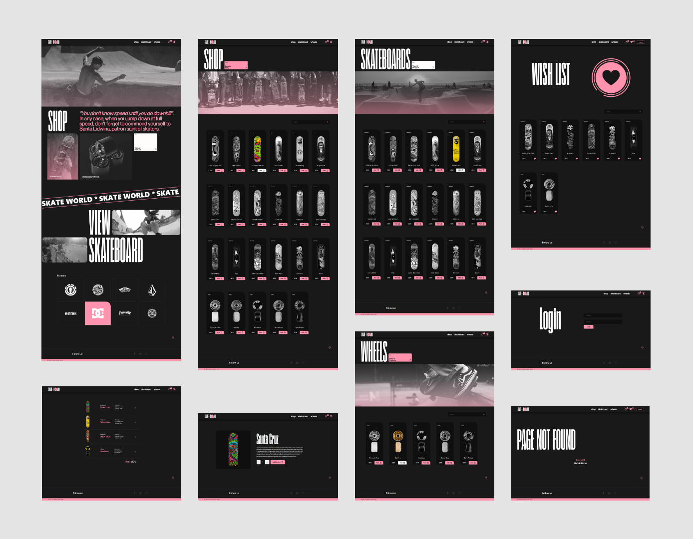

`#react-basics` `#assembler-institute-of-technology` `#master-in-software-engineering`

# React E-commerce basic

This project is a basic e-commerce website for skateboards, where you can buy different products related to skateboarding. The website has the following pages:

- Home page
- Shop page with all the products
- Skateboard category page
- Wheels category page
- Error 404 page
- Login page
- Private route for the wishlist page

This project was developed using React and the following hooks and functions: 

useEffect, useState, useContext, useNavigate, useParams, useSearchParams, useMemo, useCallback, custom hook, react-router-dom.

## Desing 🔰

 

## Getting Started 🚀

This project was bootstrapped with Create React App.

To get started, run the following commands in the terminal:

- npm install
- npm start

The app will run by default on http://localhost:3000/

#### Prerequisites 📋

To install and run this software, you will need Node.js and NPM or Yarn installed on your machine.

#### Installation 🔧

To install the necessary dependencies, run the following command:

- npm install

#### Running the tests ⚙️

To run the automated tests for this system, run the following command:

- npm test

#### End-to-End Tests 🔩

The end-to-end tests check the entire system, verifying that all parts of the application are working together as expected.

### Deployment 📦

To deploy this project, you will need to run the following command:

- npm run build

This will create a build of the project that can be deployed to a web server.

### Built With 🛠️

This project was built with the following tools:

- React
- Node.js
- NPM

### Authors ✒️

* **Jose Torres** - [88jose](https://github.com/88jose)

